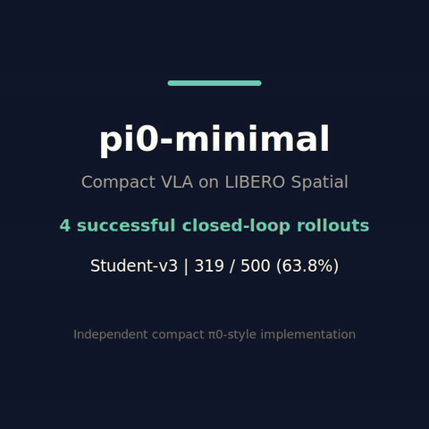
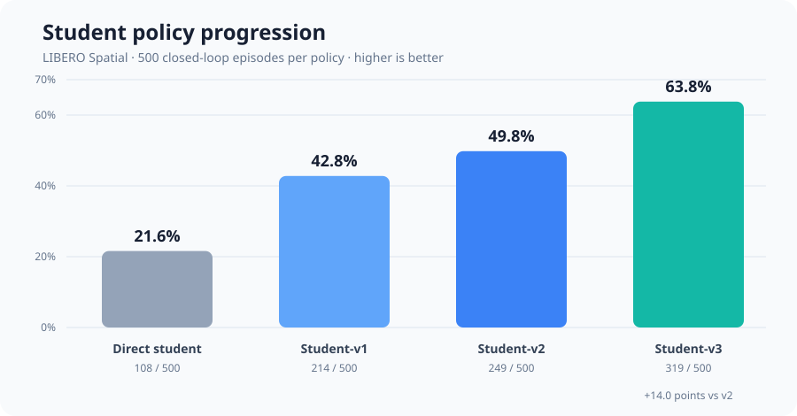
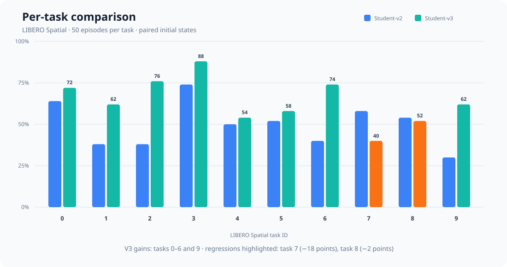
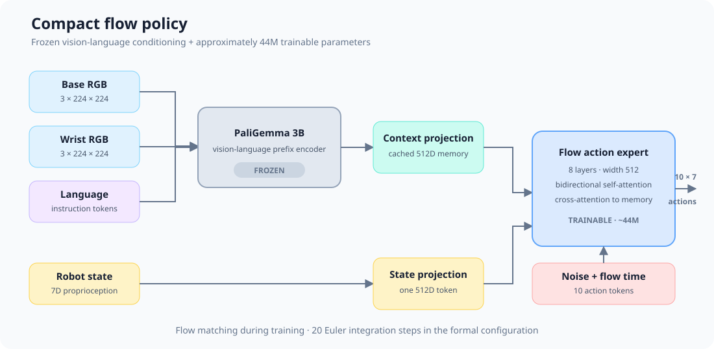

# pi0-minimal

[](https://github.com/NovR31n/pi0-minimal/actions/workflows/ci.yml)
[](https://www.python.org/)
[](LICENSE)
[](https://github.com/NovR31n/pi0-minimal/releases/latest)

An independent, compact π0-style vision-language-action policy for controlled
flow-matching and autoregressive experiments on LIBERO.

The frozen Student-v3 checkpoint achieves **319/500 (63.8%)** on LIBERO
Spatial, a **+14.0 percentage-point** paired improvement over Student-v2 on the
same 500 task/state identities. The repository contains the independently
implemented policy, training and rollout stack, evaluation protocol, reports,
and machine-readable result summaries.

[Reproduce](docs/reproduction.md) ·
[Formal report](reports/2026-08-13_student_v3_formal_500.md) ·
[Result data](results/) ·
[Architecture](docs/architecture/) ·
[Release](https://github.com/NovR31n/pi0-minimal/releases/latest)

## Demo

[](assets/demo/student_v3_demo.mp4)

Four representative successful rollouts from the frozen 500-episode evaluation.
The montage shows selected successes rather than an estimated success rate;
the complete result is 319/500. Click the preview for the higher-quality MP4.



## Highlights

- **63.8% closed-loop success:** 319 successes over a complete 10-task,
  500-episode LIBERO Spatial matrix, with zero rollout exceptions.
- **Paired evidence:** Student-v3 gains 123 episodes and loses 53 relative to
  Student-v2; two-sided exact McNemar `p = 1.371e-7`.
- **Compact trainable policy:** approximately 44M trainable parameters around a
  frozen PaliGemma condition encoder.
- **Recovery distillation:** successful teacher corrections from
  student-induced states raise the score from 49.8% to 63.8%.
- **Auditable workflow:** frozen checkpoint gates, explicit task/state
  identities, versioned reports, result data, and CPU CI.

This project does not import OpenPI's π0 model, flow loss, or action sampler.
It is not affiliated with Physical Intelligence, Google, or the LIBERO authors.

## Main result

| Policy | Training stage | Success | Rate |
| --- | --- | ---: | ---: |
| Direct compact student | Video demonstrations | 108/500 | 21.6% |
| Student-v1 | Balanced teacher distillation | 214/500 | 42.8% |
| Student-v2 | All-task balanced distillation | 249/500 | 49.8% |
| **Student-v3** | **Recovery-data continuation** | **319/500** | **63.8%** |

Student-v3's Wilson 95% confidence interval is **59.5%–67.9%**. The paired
table against Student-v2 is 196 both-success, 123 V3-only, 53 V2-only, and 128
both-fail. All 500 Student-v3 rollouts completed without an exception.



Student-v3 improves eight of ten tasks. Task 7 regresses from 58% to 40%, and
task 8 slips from 54% to 52%; these are documented rather than hidden by the
aggregate gain. Full values are available as
[`JSON`](results/student_v3_formal_500_summary.json) and
[`CSV`](results/student_v3_per_task.csv), with protocol details in the
[`formal report`](reports/2026-08-13_student_v3_formal_500.md).

## Model



The compact Flow policy uses:

- two 224 × 224 RGB views and a language instruction;
- frozen `google/paligemma-3b-pt-224` vision-language conditioning;
- one projected 7D robot-state token;
- an eight-layer, width-512 action expert with bidirectional self-attention and
  cross-attention to cached vision-language context;
- ten 7D action tokens trained with a masked flow-matching objective;
- twenty Euler integration steps at inference time in the committed formal
  configuration.

The trainable policy is approximately 44M parameters. A matched continuous
autoregressive baseline shares the observation encoder, state conditioning,
action horizon, decoder scale, and evaluation protocol. Detailed tensor,
attention, and objective contracts live in [`docs/architecture`](docs/architecture/).

## Why Student-v3 improves

Student-v3 continues from Student-v2's retained generation-best checkpoint
with three
independently balanced sources:

- 50% all-task LIBERO demonstrations;
- 25% balanced successful trajectories from the official teacher;
- 25% successful teacher recoveries from student-induced states.

The recovery dataset contains 39 successful trajectories and 785 teacher
queries. Teacher failures and infrastructure errors are excluded from the
student training index. Explicit source/task probabilities prevent raw
trajectory length from silently controlling the training mixture.

Large frozen condition caches remain separate and are gathered segment by
segment, avoiding another full-cache concatenation under a 62 GiB host-memory
budget. Peak trainable-model CUDA allocation was approximately 1.4 GiB;
closed-loop inference including the frozen backbone used approximately 5.9 GiB.

## Evaluation discipline

The result follows a staged, predeclared protocol:

1. retain 2K, 5K, 9K best-generation, and 10K checkpoints;
2. choose once on a frozen 100-episode development panel;
3. require that checkpoint to pass an untouched 90-episode gate;
4. evaluate the frozen checkpoint on the complete 500-episode matrix;
5. preserve task/state identities, exceptions, traces, configuration,
   checkpoint step, and hashes in the private artifact store.

The development panel is not reported as the final success rate. Offline
action MAE is a health metric, not the closed-loop checkpoint selector. The
selection record is in the
[`checkpoint-gate report`](reports/2026-08-13_student_v3_checkpoint_gate.md).

## Quick start

Python 3.11 and [`uv`](https://docs.astral.sh/uv/) are recommended.

```bash
git clone https://github.com/NovR31n/pi0-minimal.git
cd pi0-minimal
uv sync --extra dev
uv run --frozen python scripts/validate_model_spec.py
uv run --frozen ruff check .
uv run --frozen python -m pytest -q
```

The CPU tests use a deterministic dummy condition encoder and do not require
PaliGemma access, LIBERO, CUDA, datasets, or checkpoints.

For real LIBERO rollouts:

```bash
uv sync --extra dev --extra libero
export PYTHONPATH=/path/to/LIBERO
export MUJOCO_GL=egl
```

Real training and rollout additionally require acceptance of the gated
PaliGemma license and external datasets/checkpoints. Follow the staged
[`reproduction guide`](docs/reproduction.md) for exact entry points and the
boundary between public and licensed artifacts.

## Repository layout

```text
.github/workflows/   CPU lint and test automation
assets/              README architecture and result visualizations
configs/             Model, data, task, and experiment configurations
docs/architecture/   Tensor, mask, attention, and objective specifications
reports/             Versioned experiment and failure-analysis reports
results/             Machine-readable public result summaries
scripts/             Data, training, rollout, aggregation, and audit tools
src/pi0_minimal/     Independent model and data implementation
tests/               CPU unit, integration, and result-consistency tests
```

Core entry points include:

- `scripts/prepare_libero_data.py` — episode-disjoint splits and statistics;
- `scripts/train_flow_small.py` — resumable Flow/AR training;
- `scripts/rollout_libero_matrix.py` — serial closed-loop matrices;
- `scripts/aggregate_rollout_metrics.py` — confidence intervals and paired
  comparisons;
- `scripts/analyze_failure_traces.py` — conservative failure proxies;
- `scripts/collect_teacher_corrections.py` — provenance-preserving recovery
  collection.

Datasets, gated weights, checkpoints, cached condition tensors, complete
rollout traces, and videos are intentionally excluded from Git.

## Limitations

- Results are from LIBERO simulation, not a physical robot.
- The formal Student-v3 result uses one training seed.
- The frozen PaliGemma backbone and official teacher are pretrained external
  components; this repository independently implements the compact student.
- Task 7 regresses relative to Student-v2 despite the aggregate gain.
- Exact rollout regeneration requires licensed artifacts that cannot be
  redistributed here.

## References

- [π0: A Vision-Language-Action Flow Model for General Robot Control](https://arxiv.org/abs/2410.24164)
- [OpenPI](https://github.com/Physical-Intelligence/openpi)
- [LIBERO](https://github.com/Lifelong-Robot-Learning/LIBERO)
- [PaliGemma model card](https://huggingface.co/google/paligemma-3b-pt-224)

Licensed under [Apache-2.0](LICENSE).
